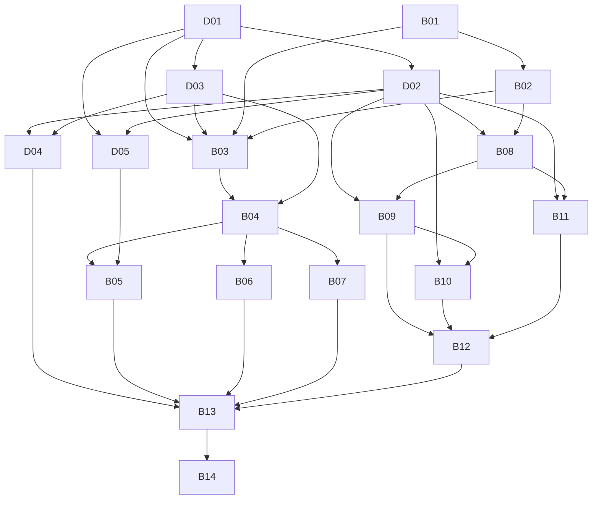

# AgentHub V1 任务地图

本目录是 AgentHub V1 的正式仓库内 Issue tracker。需求规格见 [`spec.md`](spec.md)，每个任务在 `issues/` 中独立维护。GitHub 不保存需求状态，只用于 CI/CD 和发布。

任务总览见 [`status.md`](status.md)；详细验收证据和讨论仍记录在对应的 `issues/*.md` 文件中。

## 状态规则

- `Status: open`：尚未领取；所有 `Blocked by` 均为 `resolved` 时可开始。
- `Status: claimed`：AI 或开发者正在处理；领取后必须先提交状态变化。
- `Status: needs-info`：需要产品决策或外部信息。
- `Status: resolved`：验收标准全部满足，结果和验证记录已写入任务。
- `Status: wontfix`：明确不实施，并在任务中记录原因。

AI 先处理 `Dxx` 决策任务，再处理 `Bxx` 构建任务；同一组内按编号选择最小的“open 且无未解决依赖”任务。实现过程中发现新范围时新增任务文件，不静默扩大当前任务。

## 依赖图

## 决策任务

- [D01 Agent 与 Skill 兼容矩阵](issues/D01-compatibility-matrix.md)
- [D02 Skill 领域模型与来源规范](issues/D02-skill-domain-model.md)
- [D03 配置写入、备份与敏感数据策略](issues/D03-config-safety.md)
- [D04 配置中心与 Skills 中心交互原型](issues/D04-ux-prototype.md)
- [D05 配置作用域、优先级与冲突规则](issues/D05-scope-precedence.md)

## 构建任务

- [B01 Tauri + React 工程骨架](issues/B01-app-scaffold.md)
- [B02 SQLite 与应用状态基础](issues/B02-persistence-foundation.md)
- [B03 Claude Code 全局配置纵向切片](issues/B03-claude-global-config.md)
- [B04 安全编辑、Diff、备份与回滚](issues/B04-safe-config-editing.md)
- [B05 工作空间配置管理](issues/B05-workspace-config.md)
- [B06 Codex 配置适配](issues/B06-codex-adapter.md)
- [B07 OpenCode 配置适配](issues/B07-opencode-adapter.md)
- [B08 已安装 Skills 可视化盘点](issues/B08-skill-inventory.md)
- [B09 远程 Git 与本地仓库 Skill 来源](issues/B09-git-skill-source.md)
- [B10 标准 Marketplace 来源](issues/B10-marketplace-source.md)
- [B11 skills.sh 来源](issues/B11-skills-sh-source.md)
- [B12 Skill 生命周期与多 Agent 安装](issues/B12-skill-lifecycle.md)
- [B13 诊断、冲突和恢复体验](issues/B13-diagnostics.md)
- [B14 跨平台验收与发布](issues/B14-release.md)

## 通用完成标准

每个构建任务必须包含自动化测试、用户可理解的错误信息、文档更新，以及 `fmt`、Clippy、前端 lint、类型检查和相关测试通过。配置或 Skill 写入任务还必须验证“失败不破坏原文件”。
