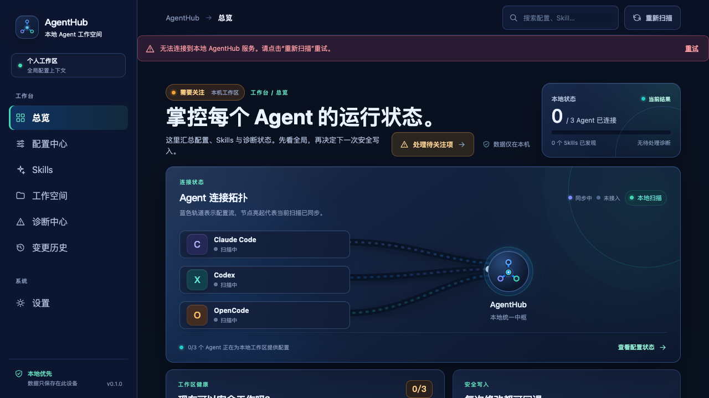
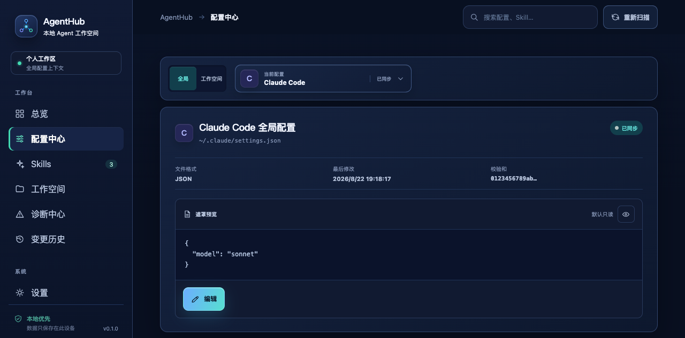
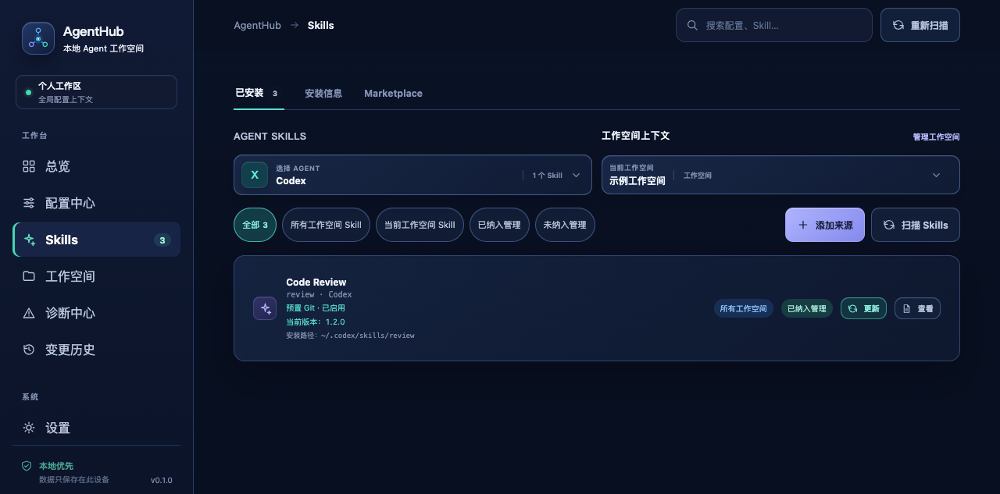
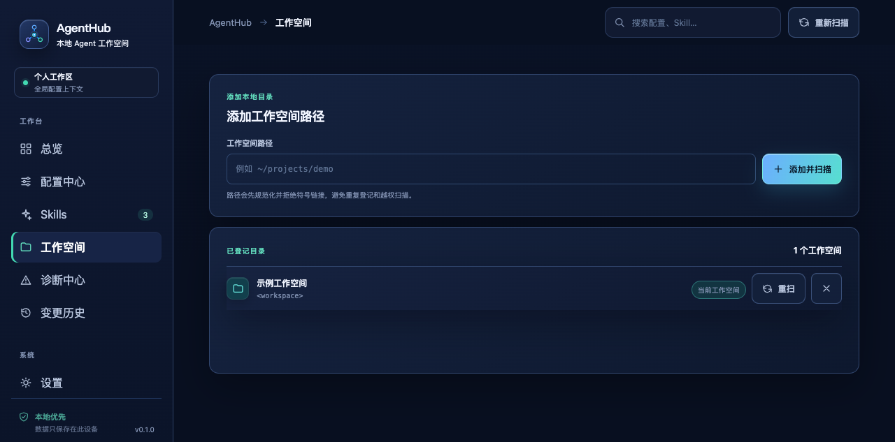
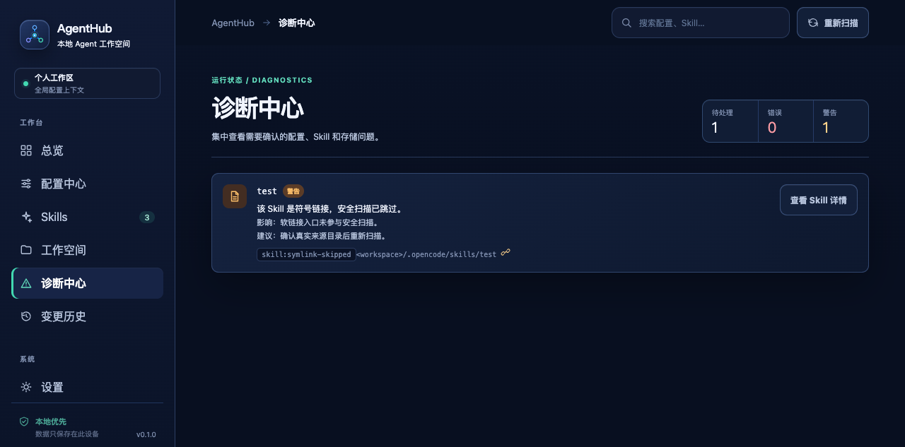

# AgentHub

[](https://github.com/JTBlink/agent-hub/releases)
[](LICENSE)
[](https://github.com/JTBlink/agent-hub/actions/workflows/ci.yml)

> **[官网 & 下载页](https://jtblink.github.io/agent-hub/)** &mdash; 获取最新安装包、查看更新日志和平台支持信息。

AgentHub 是一个本地优先的 AI Agent 配置与 Skills 管理器。它把 Claude Code、Codex 和 OpenCode 分散在全局目录、项目目录中的配置文件和 Skills 集中到一个工作台里，让你可以先看清状态，再安全地修改、安装和恢复。

## 它解决什么问题

当多个 Agent 同时使用时，常见问题不是“不会配置”，而是：

- 不确定某个配置文件到底被哪个 Agent、哪个作用域读取；
- 改错 JSON、JSONC、TOML、YAML 或 Markdown 后，终端工作流突然失效；
- 同一个 Skill 在不同来源、版本或作用域重复安装，难以判断实际生效项；
- 配置被其他编辑器改过后，直接覆盖会丢失最新内容。

AgentHub 的目标是把这些信息和风险放到操作前面，而不是替代 Agent 本身的终端或对话能力。

## 实际界面

以下截图来自当前开发版，使用脱敏演示数据展示已连接状态、配置、Skills、工作空间和诊断中心，不包含真实用户名或本机路径。

<p align="center">
  
</p>

<table>
  <tr>
    <td></td>
    <td></td>
  </tr>
  <tr>
    <td></td>
    <td></td>
  </tr>
</table>

## 你可以用它做什么

### 管理 Agent 配置

- 扫描 Claude Code、Codex、OpenCode 的全局配置和已登记工作空间；
- 按 Agent、作用域、实际路径和文件格式查看配置；
- 在表单视图和源码视图之间切换，保留无法解析文件的原文和诊断；
- 写入前生成 Diff，确认后自动备份并原子替换；
- 在历史记录中查看操作、恢复备份，避免手动复制配置文件。

### 管理 Skills

- 从 skills.sh、标准 Marketplace、Git 仓库或本地目录发现 Skills；
- 查看来源版本、兼容性、安装目标和文件指纹；
- 为不同 Agent、全局作用域或工作空间创建安装、更新、启用、禁用和卸载计划；
- 执行前预览目标文件、Diff、权限变化和回滚点；
- 识别重复 Skill、冲突目标、外部修改和版本异常。

## 推荐工作流

1. 登记一个工作空间，点击扫描，确认 AgentHub 发现了哪些 Agent 和配置文件。
2. 在配置中心按 Agent 和作用域定位文件，先查看解析状态、实际路径和诊断。
3. 修改配置后检查 Diff；只有确认计划后才会写磁盘，写入前会创建备份。
4. 在 Skills 中添加来源并扫描版本，选择目标 Agent 和作用域，确认安装计划后再执行。
5. 如果发现外部修改、冲突或安装异常，回到诊断和历史记录处理，不直接覆盖文件。

磁盘上的配置文件始终是真实数据源。SQLite 只保存索引、校验和、操作记录及备份位置，不保存可直接覆盖配置的敏感正文。

## 安全边界

- 默认只读扫描，不会因为扫描而修改工作空间文件；
- 外部程序在确认期间改动文件时，AgentHub 会阻止静默覆盖并要求重新载入；
- Token、密码等敏感字段默认遮罩，日志和操作记录不记录完整配置正文；
- 未确认的配置变更或 Skill 计划不会自动执行。

AgentHub 当前不提供云同步、多人协作、远程 Agent 托管、账号计费或内置 Agent 对话终端。它负责配置和 Skills 的可见性、可控变更与恢复，不替代 Claude Code、Codex 或 OpenCode。

## 开始使用

### 本地开发

```bash
npm ci
./agent-hub.sh dev
```

修改图标或 Tauri 配置后，如果开发模式仍显示旧构建缓存，可执行：

```bash
./agent-hub.sh clean
./agent-hub.sh dev
```

### 常用命令

| 命令                                      | 用途                            |
| ----------------------------------------- | ------------------------------- |
| `./agent-hub.sh dev`                      | 启动 Tauri + React 开发模式     |
| `./agent-hub.sh build`                    | 构建当前平台安装包              |
| `./agent-hub.sh clean`                    | 清理 Tauri/Cargo 构建缓存       |
| `./agent-hub.sh test`                     | 运行前端和 Rust 测试            |
| `./agent-hub.sh lint`                     | 运行 ESLint、Rust fmt 和 Clippy |
| `./agent-hub.sh release <目录> <git-ref>` | 汇总并校验发布产物              |

## 文档与项目状态

- [产品概述](docs/product/overview.md)：定位、范围和 V1 交互结论；
- [系统架构](docs/architecture/overview.md)：前端、Rust、SQLite 与文件系统边界；
- [文档导航](docs/README.md)：配置、作用域、Skills 来源和开发说明；
- [PRD 与交互稿](docs/agenthub-prd/agenthub-prd.html)：产品需求与交互说明；
- [变更记录](CHANGELOG.md)：版本发布说明；
- [需求与开发状态](.scratch/agent-hub-v1/README.md)：仓库内正式 tracker。

GitHub Actions 只用于持续集成、跨平台构建和发布；需求、依赖和开发状态以 `.scratch/` 为准。
